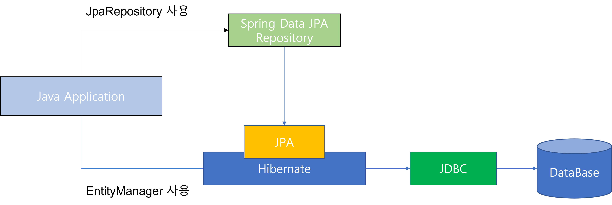

> 참고문서
> > [Incheol's TECH BLOG](https://incheol-jung.gitbook.io/docs/q-and-a/spring/jpa-vs-mybatis)   
> > [KR_SHIN](https://velog.io/@ovan/SpringBoot-JPA-%EC%9D%B4%EB%A1%A0)
## 기존
Java로 DB에 접근 시 평소 두 가지 방법을 사용했다.   
JDBC API를 이용하는 방법과 MyBatis, Spring JDBC와 같은 SQL Mapper를 사용했었다.   
JDBC API는 매번 커넥션 객체 생성 및 수많은 중복작업이 필요했고, 생산성이 매우 떨어졌었다.   

MyBatis는 Java에서 SQL Mapper를 지원하는 프레임워크로 SQL 작성을 직접하여 객체와 연결시켜주었으나 
DB가 변경될 떄 마다 쿼리를 직접 수정해야했고 중복쿼리가 많았으며, 쿼리를 작성하기 떄문에 DB에 종속적이였다.   


## JPA란
JPA, Java Presistence API의 약자   
JAVA ORM (Obejct-Relational Mapping)기술에 대한 API 표준 명세   
JPA는 단순한 명세기에 JPA만으로는 어떤 구현 기술을 사용할 수 없다.


### JPA의 장점
- 1차 캐시, 쓰기 지연, 변경감지, 지연로딩을 제공하여 성능 이점
- 코드로 관리되므로 사용하기 용이하고 생산성이 높음
- 컴파일에서 오류 확인 가능
- DB에 종속적이지 않음으로 특정 쿼리를 사용하지 않아 추상적 기술 구현 가능
- 엔티티로 관리, 스키마 변경 시 엔티티만 수정하면 해당 엔티티를 사용하는 쿼리는 자동으로 변경된 내역이 반영
- 쿼리에 대한 이해가 부족해도 코드 레벨로 어느정도 커버 가능
- 객체지향적으로 데이터 관리
- 다양한 쿼리 빌더와 호환하여 부족한 부분 보완

### JPA의 단점
- JPA만 사용하여 복잡한 연산을 수행하기엔 무리가 있음
- 초기에는 생산성이 높을 수 있으나 사용하다보면 성능상 이슈 발생 가능성이 있음(N+1, FetchType, Proxy, 연관관계)
- 고도화 될수록 러닝커브가 높아진다. 성능이슈의 연장선, 해결방안에 따라 복잡한 내부로직을 이해할 필요 생김

## JPA를 사용하는 이유
### 패러다임의 일치와 SQL의존 탈출
RDB는 어떻게 데이터를 저장할 지에 초점이 맞취진 기술   
객체지향프로그래밍 언어는 메세지를 기반으로 기능과 속성을 한 곳에서 관리하는 기술
두 서로 다른 패러다임을 가지고 있어도 객체를 데이터베이스에 저장하려고 하기에 패러다임 불일치 발생   

### JPA는 이러한 패러다임 불일치를 해결   
JPA를 사용하면 개발자는 객체지향 프로그래밍을 하고, JPA는 이를 관계형 데이터베이스에 맞게 SQL을 생성하여 대신 실행   
개발자는 SQL에 종속적인 개발을 하지 않아도 됨   
또한 객체중심으로 개발하기에 생산성이 향상되고 유지보수가 편리해짐
하지만 JPA를 잘 사용하기 위해선 RDB에 대한 이해와 공부 필요

## Spring Data JPA
JPA는 인터페이스이기에 이를 사용하기 위한 구현체가 필요
대표적으로 Hibernate, Eclipse Link 등이 존재
Spring에서는 이러한 구현체들을 직접 다루지 않고 구현체를 좀 더 쉽게 사용하도록 ```Spring Data JPA```라는 모듈을 제공



Hibernate를 직접 사용하는 것과 Spring Data Jpa를 사용하는 것은 큰 차이 없음   
하지만 2가지 이유로 Spring Data Jpa 사용을 권장
- 구현체 교체의 용이성
  - 새로운 더 나은 JPA구현체가 나왔을 때, Spring Data JPA를 사용하면 구현체 교체가 쉬움
- 저장소 교체의 용이성
  - 어떠한 문제로 저장소를 교체할 때 Spring Data JPA는 의존성만 교체하면 됨 (ex.MongoDB)      

Spring Data의 하위 프로젝트들은 기본적인 CRUD의 인터페이스가 같아 save, findAll, findBy등을 인터페이스로 가지고 있음   
즉 저장소가 교체되도 기본적인 기능의 사용엔 문제 없음

